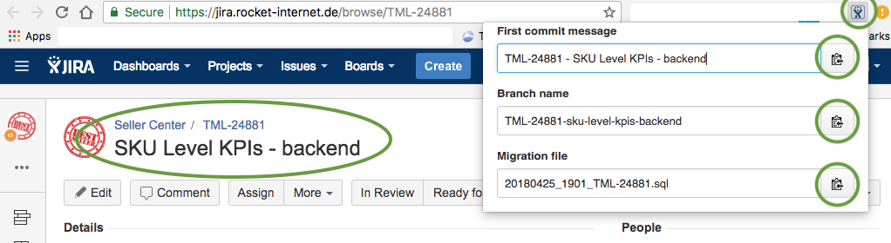

# Chrome Extension: JIRA issue tools
A Chrome extension with some tools regarding JIRA issues, e.g. branch name, first commit message, migration file name...

## Setup
* Clone the project locally
* Open "Google Chrome" settings menu > More Tools > Extensions
* Click on "Load unpacked" button and specify the folder of the just cloned extension

## Pre requisite
This extension only works if the current page url match the following patterns
* https://jira.rocket-internet.de/browse/TML-*
* https://jira.rocket-internet.de/browse/TMLSD-*
* https://jira.rocket-internet.de/browse/TMLRSIN-*
* https://jira.rocket-internet.de/secure/RapidBoard?*

## Example
Imagine to open issue "**TML-24881**" and the title is "**SKU Level KPIs - backend**", by clicking on the Extension icon you will get:

